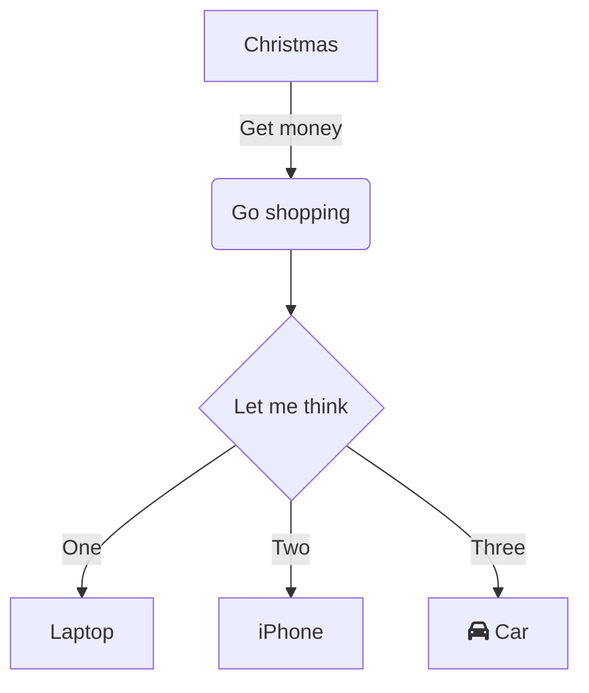

&nbsp;

<SwmLink doc-title="Test file">[Test file](/.swm/test-file.9tuyjh9d.sw.md)</SwmLink>

<SwmPath>[README.md](/README.md)</SwmPath>

&nbsp;

To run your local dev environment you will need a few things on your machine. Follow the steps below.&nbsp;



## Installations

- Install [Node JS](https://nodejs.org/en/download/), version `14.x`

- Install an IDE (preferably [VS Code](https://code.visualstudio.com/))

- Install Git (if you don't already have it on your machine).

<br/>

## Getting the sources

Clone the repository locally:

```
git clone https://github.com/my_company/company_repo.git
```

## Build

- Within the repository directory, run `yarn install` to install the project's dependencies.

- Then, build the project by running `yarn build`.

Here's what `yarn build` doing behind the scenes:

### 

<SwmSnippet path="/README.md" line="1">

---

&nbsp;

```markdown
# Tal-test-repo
test test test
```

---

</SwmSnippet>

### Troubleshooting

```
Error! Cannot execute command (...) "need executable 'ar' to convert dir to deb"(...)
```

- For electron builder to run, the package `binutils` needs to be installed. Although it should be included when installing electron on the machine/VM - it sometimes fails

- To avoid build issues, please run `sudo apt-get install binutils` to install this dependency before trying to build the app

## Windows additional steps

## Run the Tests

To run all the tests, run:

```
$ yarn test
```

To run subsets of the tests - you can use `yarn test:<name>`. For example:

```
$ yarn test:server
$ yarn test:utils
```

## Run

### macOS and Linux

```
./scripts/run.sh
```

### Windows

```
 .\scripts\run.bat
```

### Web

```
yarn web
```

## Scripts worth mentioning ⚡️✨

Serve your code with a development web server

```
$ yarn dev
```

Pack for Production. This will generate installers.

```
$ yarn pack
```

See package.json for full list of supported yarn scripts:

<SwmSnippetPlaceholder>

Insert a snippet from package.json that shows all the scripts

</SwmSnippetPlaceholder>

## Debugging

- Open DevTools by pressing Command+Option+I (Mac) or Control+Shift+I (Windows, Linux). This shortcut opens the Console panel.

- Click the Sources tab and pick a file from the files navigator.

- A common method for debugging a problem is to insert a lot of console.log() statements into the code, in order to inspect values as the script executes, but breakpoints can get it done faster.

## Congrats

You now have your dev environment ready 🎉

<SwmMeta repo-id="Z2l0aHViJTNBJTNBVGFsLXRlc3QtcmVwbyUzQSUzQVRhbFBlcmV0elN3aW1t" repo-name="Tal-test-repo"><sup>Powered by [Swimm](http://localhost:5000/)</sup></SwmMeta>
